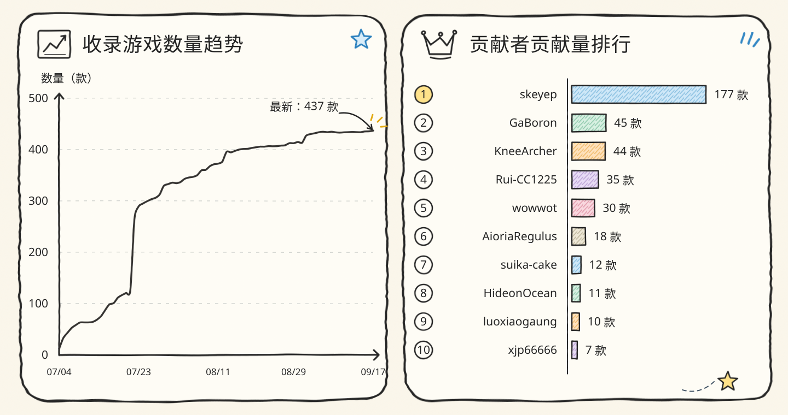

# Steam 成就翻译库

简体中文 | [English](README_EN.md)

社区维护的 Steam 成就翻译数据仓库，收录 `UserGameStatsSchema_<app_id>.bin` 文件并生成可搜索索引。

## 🚀 从这里开始

  
  
  
  

> [!TIP]
> 普通用户建议直接使用 **Steam 成就翻译管理器**：它可以查找、安装、编辑、备份和恢复译本。本仓库主要面向数据浏览与投稿。

## 📚 翻译库操作

- **找译本：**在 [INDEX.md](INDEX.md) 中搜索 Steam app ID；这是最准确的检索方式。多版本游戏请按版本说明选择文件，并留意“可能过期”或“可能不生效”状态。
- **没有译本：**提交 [翻译请愿](https://github.com/GaBoron/steam-achievement-translation-library/issues/new?template=translation_petition_zh.yml)，并附上 Steam 生成的原始 schema ZIP。
- **贡献译本：**按照 [贡献指南](CONTRIBUTING.md) 提交 [新游戏](https://github.com/GaBoron/steam-achievement-translation-library/issues/new?template=translation_contribution_zh.yml)或 [更新已有文件](https://github.com/GaBoron/steam-achievement-translation-library/issues/new?template=translation_update_zh.yml)。
- **发现问题：**使用 [文件错误报告](https://github.com/GaBoron/steam-achievement-translation-library/issues/new?template=outdated_report_zh.yml)标记过期或不生效的译本；有新版文件时请直接提交更新。

直接下载文件时，请确认文件名和 app ID 一致。安装、备份与恢复建议交给 [Steam 成就翻译管理器](https://github.com/GaBoron/steam-achievement-translation-installer)，避免手工覆盖错误文件。

## 🔄 项目协作

| 项目 | 职责 |
| --- | --- |
| **本仓库** | 保存社区译本、索引和投稿记录 |
| [Steam 成就翻译管理器](https://github.com/GaBoron/steam-achievement-translation-installer) | 使用本仓库数据完成扫描、预览、安装、编辑、备份与恢复，并可导出投稿 ZIP |
| [Steam Achievement Localizer Skill](https://github.com/GaBoron/steam-achievement-localizer-skill) | 查询本仓库参考译本，通过 Codex 研究和制作翻译，输出可由管理器导入或向本仓库投稿的 BIN/ZIP |

偏好独立的本地可视化编辑器时，也可以使用 [PanVena/SteamAchievementLocalizer](https://github.com/PanVena/SteamAchievementLocalizer)。

## 📈 收录统计

## ⚖️ 许可证与权利

详见 [LICENSE.md](LICENSE.md)。工作流脚本采用 MIT；贡献者自有翻译部分采用 CC BY 4.0；原始游戏内容、成就文本和 Steam schema 仍归对应权利方所有。
