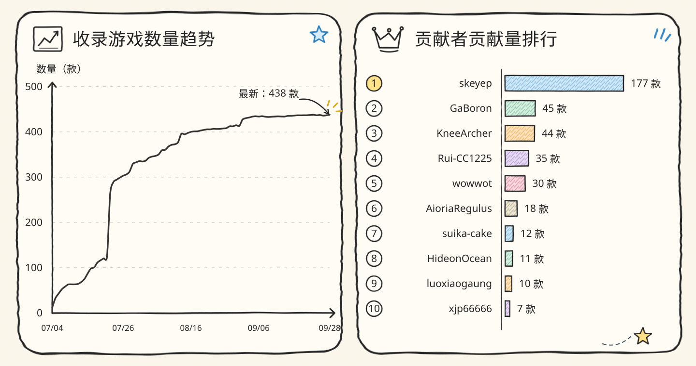

# Steam 成就翻译库

简体中文 | [English](README_EN.md)

社区维护的 Steam 成就翻译数据仓库，保存成就译本 BIN，并提供配套 JSON 和可搜索索引，供 SATLI 本体与 SATLI lite 使用。

## 🚀 从这里开始

  
  
  
  

> [!TIP]
> 在 Steam 内下载和显示译本，可使用 [SATLI lite](https://github.com/GaBoron/SATLI-lite)，需要 Millennium 3.5.0 或更高版本，无需安装 SATLI 本体。管理本机 BIN、制作投稿 ZIP 或备份恢复原文件，请使用 [SATLI](https://github.com/GaBoron/SATLI)。本仓库用于浏览译本与投稿。

## 📚 翻译库操作

- **在 Steam 内使用：** 按 [SATLI lite 安装说明](https://github.com/GaBoron/SATLI-lite#安装) 安装插件，在“管理译本”中选择游戏、译本与语言，预览后下载并应用；无需手动下载或替换 BIN。
- **找译本：** 在 [INDEX.md](INDEX.md) 中搜索 Steam app ID；这是最准确的检索方式。多版本游戏请按版本说明选择文件，并留意“可能过期”或“可能不生效”状态。
- **没有译本：** 提交 [翻译请愿](https://github.com/GaBoron/steam-achievement-translation-library/issues/new?template=translation_petition_zh.yml)，并附上 Steam 生成的原始 schema ZIP。
- **贡献译本：** 按照 [贡献指南](CONTRIBUTING.md) 提交 [新游戏](https://github.com/GaBoron/steam-achievement-translation-library/issues/new?template=translation_contribution_zh.yml)或 [更新已有文件](https://github.com/GaBoron/steam-achievement-translation-library/issues/new?template=translation_update_zh.yml)。
- **发现问题：** 使用 [文件错误报告](https://github.com/GaBoron/steam-achievement-translation-library/issues/new?template=outdated_report_zh.yml)标记过期或不生效的译本；有新版文件时请直接提交更新。

直接下载文件时，请确认文件名和 app ID 一致。BIN/ZIP 供 SATLI 本体安装或投稿，V2 翻译 JSON 供 SATLI lite 使用；它们不能仅通过修改扩展名互换。BIN 安装、备份与恢复建议交给 [SATLI](https://github.com/GaBoron/SATLI)，避免手工覆盖错误文件。

## 🧭 V2 迁移状态

仓库端 Catalog V2 已上线，目前处于 V1/V2 并行迁移阶段：

- `index-v2.json` 是游戏级权威索引，也是面向 SATLI 的公开 Catalog V2 接口；可从 BIN 推导的哈希、大小、语言和成就数均由自动化计算。
- 各版本固定使用 `files/<app_id>/<variant_id>/UserGameStatsSchema_<app_id>.bin`，并由对应 BIN 自动生成同目录下的 `achievements.md`，方便直接在 GitHub 浏览成就文本。
- 每份 BIN 同时生成同名 `.json`，供 [SATLI lite](https://github.com/GaBoron/SATLI-lite) 等显示覆盖客户端直接下载；V2 版本记录的 `json` 字段提供格式版本和 UTF-8 字节数。JSON 按成就 API name 保存所有语言的名称与描述，具体接口见 [JSON 数据格式](docs/translation-json.md)。
- V1 `index.json` 和 `files/<app_id>/UserGameStatsSchema_<app_id>.bin` 默认文件旧路径继续生成，供仅支持 V1 的 SATLI 版本使用。
- 迁移期间，新投稿和更新只需提交一次；审核 PR 仅改动该游戏目录，合并后自动化汇总待入库数据，再生成 Catalog V2、人类可读索引、统计图和 V1 兼容数据。

> [!IMPORTANT]
> **迁移截止时间为 2026 年 12 月 31 日 23:59（UTC+8）。** 自 2027 年 1 月 1 日起，本仓库不再保证继续提供 V1 `index.json` 和默认文件旧路径；仍使用 V1 的客户端须在截止前升级。客户端适配进度见 [SATLI #14](https://github.com/GaBoron/SATLI/issues/14)。

## 🔄 项目协作

| 项目 | 职责 |
| --- | --- |
| **本仓库** | 保存社区译本、Catalog 和人类可读成就目录 |
| [Steam 成就翻译管理器](https://github.com/GaBoron/SATLI) | 使用本仓库数据完成扫描、预览、安装、编辑、备份与恢复，并可导出投稿 ZIP |
| [SATLI lite](https://github.com/GaBoron/SATLI-lite) | 在 Steam 内下载 JSON、选择译本与语言、编辑本地文字并应用显示翻译；安装与操作见 [使用说明](https://github.com/GaBoron/SATLI-lite#安装) |
| [Steam Achievement Localizer Skill](https://github.com/GaBoron/steam-achievement-localizer-skill) | 查询本仓库参考译本，通过 Codex 研究和制作翻译，输出可由管理器导入或向本仓库投稿的 BIN/ZIP |

偏好独立的本地可视化编辑器时，也可以使用 [PanVena/SteamAchievementLocalizer](https://github.com/PanVena/SteamAchievementLocalizer)。

## 📈 收录统计

## 💬 联系支持

需要帮助时，请发送邮件至 [SATLI.support@proton.me](mailto:SATLI.support@proton.me)。

## ⚖️ 许可证与权利

详见 [LICENSE.md](LICENSE.md)。工作流脚本采用 MIT；贡献者自有翻译部分采用 CC BY 4.0；原始游戏内容、成就文本和 Steam schema 仍归对应权利方所有。
